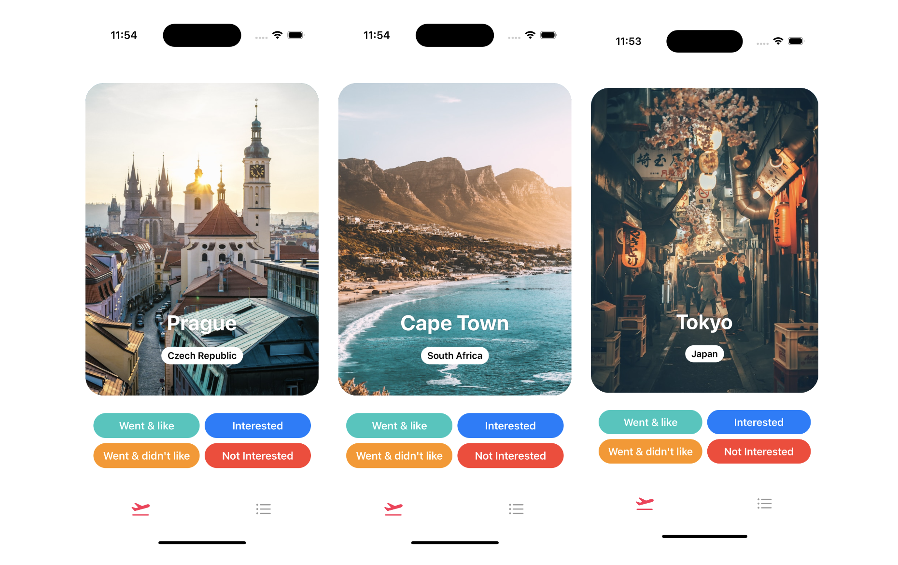
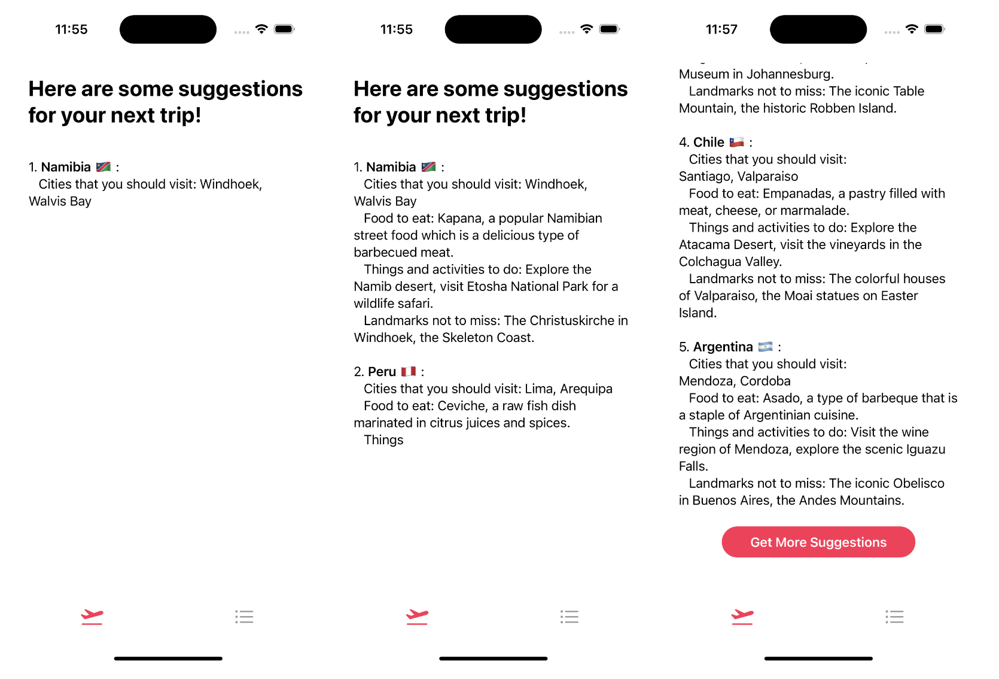
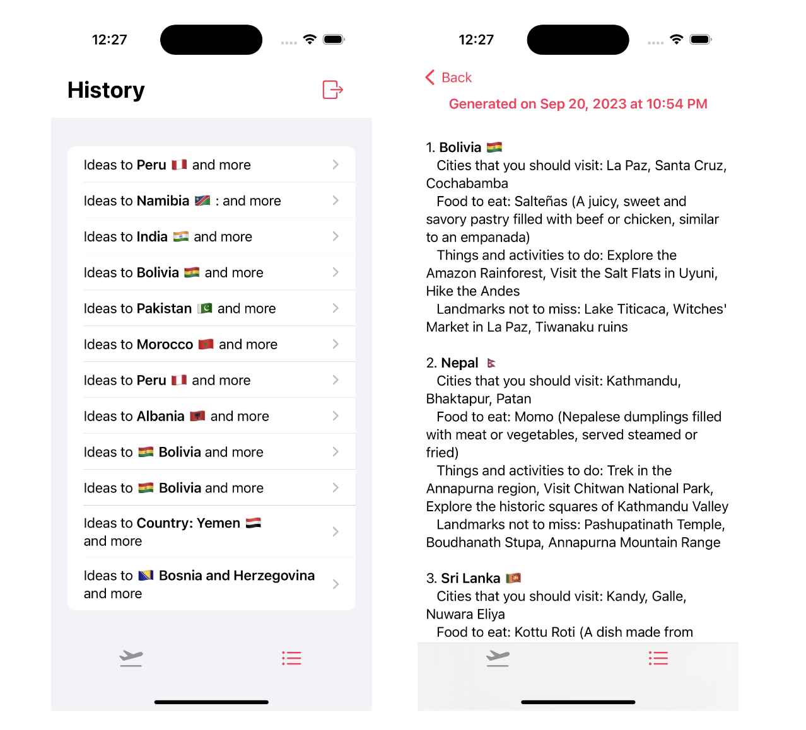

# Tripper

Tripper is an iOS AI travel planner app. It provides users with a list of photos of cities, where the user can select whether he is `Interested`/ is `Not interested`/ has `Went & Liked`/ has `Went & dislike` the place shown to him. Given the user's answers, the app will get a sense of the user's travel style and preferred kind of destinations, and then generate suggestions based on his answers.

## Demo

### Demo video

https://github.com/acyang97/tripper/assets/59875458/472ae9e8-0ba4-4bfe-b94f-19c5778806cd

### Get suggestions

  

### Bot generating data

  

### View past generated suggestions

  

## Why did I build this?

I never tried developing mobile applications before, and since my unemployement stint has been longer than I thought, I figured that I should finally pick my lazy ass up and learn something related to it. The reason for choosing Swift is simply because 1. I am an iPhone user, and 2. as someone who has been playing with React almost everyday, I wanted to try somehting outside of the JS ecosystem. It turned out to be a really fufilling experience, learning a new language, state management in SwiftUI, etc. I was very glad that SwiftUI provided so many customizable components available that makes it easy to build stuff, rather than having to compare 1 package to another everytime when creating web apps using React.

Next, I wanted to do build something related to AI, and I figured that building an app similar to ChatGPT but integrating more fun features sounds like a good start that should not take too much time. This was definitely a fun experience playing with OpenAI's API (though it might costed me a chicken rice meal), and I am definitely keen on levearaging more on LLMs on other apps I build in the future.

Lastly, as a travel maniac, I often used chatgpt to get ideas on where to travel to, hence, I was brainstorming along the ideas on how to make this more fun and interesting.

## Tech Stack

- Swift, SwiftUI, Firebase

## What I learnt

- Everything related to Swift and SwiftUI:
  - State management (`@State`, `@Binding`, etc)
  - Use of guards to deal with Optionals
  - Many SwiftUI's components
  - Making API requests in Swift
  - MVVM
- Using Firebase Authentication to authenticate users and Firebase Store
- Use of OpenAI and dealing with streaming data so that users can see response as it is being generated by the bot rather than just seeing a loading spinner for 1min+

## Future Improvements

Future improvements will be done when time permits:

- Features
  - Animations: I can't seem to get animation to work. Ideally, I want the cards to be swiped out of the phone screen on a button click.
  - UI design. Man I really need a UI Designer to help man
  - Continuing of chat: When the bot returns an initial response, allow user to continue to talk to it to get deepeer insights
  - Make use of iOS specific features maybe like Core Location, CoreML just to play around to make this app more fun.
  - Store images and cities data in some storage -> I didn't wanted to do this for my MVP because it was something I am familiar with and I wanted to play with mainly new things I never tried before
- Code stuff
  - Code refractoring -> I tried my best to follow MVVM but I think it could be done better for certain parts
